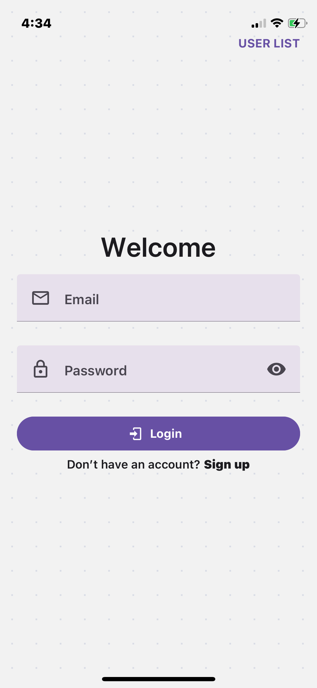
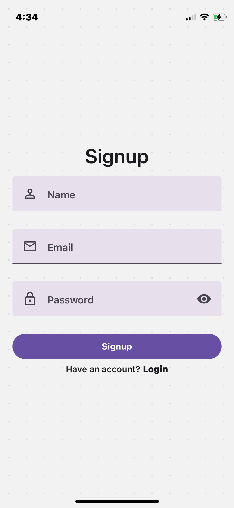
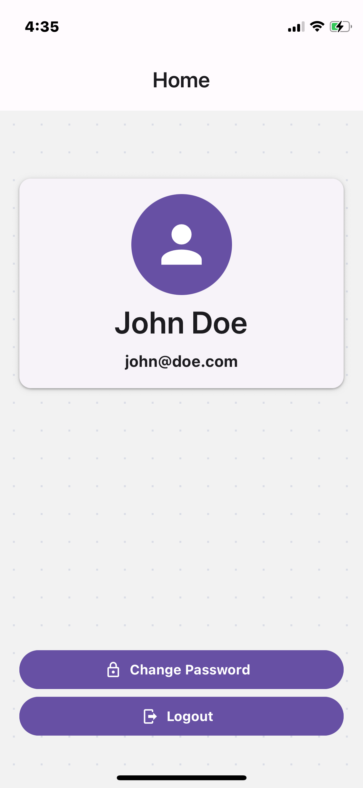
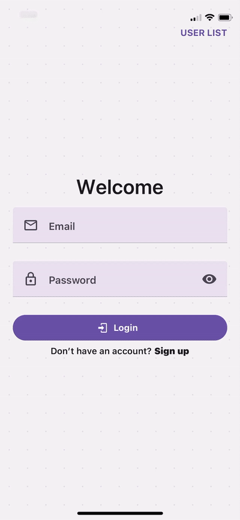

# rn-context-api-demo

## Description

React Native Context API Demo for Authentication

This demo app showcases how to implement authentication using React's Context API in a React Native environment. It uses `AsyncStorage` for persisting the user session and demonstrates login, signup, and logout flows with basic navigation.

---

## 📸 Screenshots

| Login                                                         | Signup                                                        | Home                                                          | Change Password                                               |
| ------------------------------------------------------------- | ------------------------------------------------------------- | ------------------------------------------------------------- | ------------------------------------------------------------- |
|   |   |   |   |
|  |  |  |  |

---

## 🎥 Screen Recordings

| Light Mode                                                         | Dark Mode                                                         |
| ------------------------------------------------------------------ | ----------------------------------------------------------------- |
|  |  |

---

## ⚙️ Key Technologies Used

| Technology                                                                  | Description                                                                                               |
| --------------------------------------------------------------------------- | --------------------------------------------------------------------------------------------------------- |
| [React Native](https://reactnative.dev/)                                    | A framework for building native mobile apps using JavaScript and React.                                   |
| [Expo](https://expo.dev)                                                    | A development platform that streamlines building and deploying React Native apps.                         |
| [TypeScript](http://typescriptlang.org/)                                    | A strongly typed programming language that builds on JavaScript, providing better tooling at any scale.   |
| [React Navigation](https://reactnavigation.org)                             | A routing and navigation library for React Native apps.                                                   |
| [AsyncStorage](https://github.com/react-native-async-storage/async-storage) | A simple, unencrypted, asynchronous key-value storage system for persisting data locally in React Native. |
| [Context API](https://react.dev/reference/react/createContext)              | A built-in React feature for managing global state across components.                                     |
| [React Native Paper](https://reactnativepaper.com/)                         | A cross-platform UI component library that follows Material Design guidelines.                            |

---

## 🖥️ Environment setup

- Install [NodeJS](https://nodejs.org/en/) from installer or via [Homebrew](https://formulae.brew.sh/formula/node) for MacOS/Linux or [Chocolatey](https://community.chocolatey.org/packages/nodejs) for Windows.
- Verify `node` and `npm` commands from terminal: `node -v && npm -v`.
- (Optional) Install [`yarn`](https://yarnpkg.com/) package manager.

---

## 🛠️ Setup Instructions

### ⬇️ Clone repo

```bash
git clone https://github.com/YahyaBagia/rn-context-api-demo.git
```

### 📦 Install Packages

```bash
yarn # or npm install
```

### 🏁 Run Project

```bash
yarn ios # launches iOS simulator
# OR
yarn android # launches Android emulator
# OR
yarn web # launches Web Browser
```

---

## 🧩 Explanation

### 🔐 Authentication Features

- **Login:** Validates user credentials from a local in-memory list stored in `AsyncStorage`.
- **Signup:** Registers a new user (if not already existing) and appends them to the user list in `AsyncStorage`.
- **Logout:** Clears the session and navigates back to the auth screens.
- **Auto-login on App Launch:** Loads the persisted session if a user was previously logged in.

### 🧠 Context API Integration

- Auth state (`user`) and auth actions (`login`, `signup`, `logout`) are globally managed using React's Context API.
- Auth state is accessible from any component via the `useAuth` hook.

### 🧭 Navigation Flow

- Uses React Navigation stack:
  - `Login` and `Signup` when user is not logged in.
  - `Home` screen once the user logs in or signs up.
- Conditional rendering is handled in `RootNavigator`.

---

## 📌 Notes

- This app does **not** use any backend or API. All user data is stored locally.
- Passwords are stored in plaintext for demonstration purposes only.
